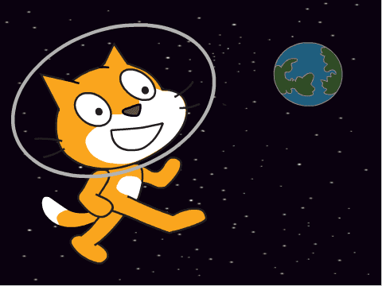
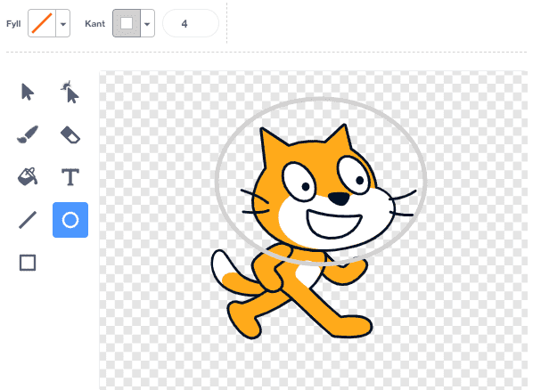

# Introduksjon {.intro}

Katten vår har så lyst å være en astronaut, la oss se om vi kan hjelpe ham?
Underveis vil vi lære hvordan vi flytter figurer rundt på skjermen, og hvordan
katter blir påvirket av gravitasjonskreftene fra jorden.



# Steg 1: En flyvende katt {.activity}

Vi begynner prosjektet vårt med å få katten til å fly!

## Sjekkliste {.check}

- Start et nytt prosjekt. Når du står på startsiden til Scratch kan du
  starte et nytt prosjekt på to måter. Gå til [scratch.mit.edu](https://scratch.mit.edu).

  1. Hvis du ikke har en bruker kan du trykke på `Direkte til programmering` på
     forsiden. Da blir du sendt til verktøyet der vi faktisk programmerer.

  2. Dersom du har en bruker kan du logge inn og deretter trykke på navnet
     ditt øverst i høyre hjørne. Trykk så `Mine ting` og til slutt
     `Nytt prosjekt`.

  Du vil se en katt som venter på å bli programmert!

  Hvis du allerede har prøvd deg frem med noe kan du starte et nytt prosjekt ved
  å velge `Fil` over programmeringsområdet og så `Ny`.

- Prøv å klikk på de blå klossene til venstre på skjermen. For eksempel, om
  du klikker på

  ```blocks
  gå (10) steg
  ```

  skal du se at katten flytter litt på seg, og om du klikker på

  ```blocks
  snu @turnRight (15) grader
  ```

  vil den snu seg! Disse klossene er kommandoer vi kan gi til
  katten!

- Legg merke til at til venstre for de blå klossene er det flere kategorier
  av kommandoer i forskjellige farger, for eksempel `Utseende`{.blocklooks} og
  `Lyd`{.blocksound}. Klikk på disse kategoriene og prøv noen av klossene du
  finner!

- Når vi programmerer så lager vi script, som er lister over kommandoer som
  skal kjøres.

  For å sette sammen flere kommandoer til et skript kan du dra klosser
  til det store tomme området til midt på skjermen.

  Prøv å pusle sammen disse klossene (bruk fargene for å finne
  riktig kategori):

  ```blocks
  når @greenFlag klikkes
  gjenta for alltid
      gå (10) steg
      snu @turnRight (15) grader
  slutt
  ```

## Test prosjektet {.flag}

Legg merke til at den første klossen sier at noe skal skje når vi klikker et
grønt flagg. Nær toppen av skjermen, over vinduet med katten, finner du et grønt
flagg. **Klikk på det!**

- Du skal se at katten flytter seg rundt i en sirkel. Les koden du laget en
  gang til. Skjønner du hvorfor katten går i sirkel?

- Prøv å endre tallene i koden din. Kan du få katten til å gå saktere? I
  større sirkler?

## Sjekkliste {.check}

- Nå skal vi endre litt på koden slik at vi kan kontrollere hvordan katten
  beveger seg. I kategorien `Sansning`{.blocksensing} finnes en kloss som
  reagerer når en tast er trykket. Den kan vi bruke til å styre katten med
  piltastene.

  Bytt ut klossene i koden din slik at den blir seende slik ut:

  ```blocks
  når @greenFlag klikkes
  gjenta for alltid
      hvis <tast [pil høyre v] trykket?>
          snu @turnRight (5) grader
      slutt
      hvis <tast [pil venstre v] trykket?>
          snu @turnLeft (5) grader
      slutt
      hvis <tast [pil opp v] trykket?>
          gå (5) steg
      slutt
  slutt
  ```

## Test prosjektet {.flag}

**Klikk på det grønne flagget.**

- Kan du styre katten rundt ved å bruke piltastene?

- Forstår du hvordan katten kontrolleres?

- Kan du få katten til å fly raskere eller saktere ved å endre i koden?

# Steg 2: Ut i verdensrommet! {.activity}

Nå skal vi sende den flyvende katten ut i verdensrommet.

## Sjekkliste {.check}

- Klikk på  nederst til
  høyre på skjermen for å hente inn en ny bakgrunn. Velg bakgrunnen `Stars` som
  du finner i kategorien `Romfart`.

- Vi skal også gi katten en liten romhjelm, siden den flyr rundt ute i
  rommet. Klikk på katten i figurvinduet og deretter på fanen `Drakter` øverst
  til venstre på skjermen.

- Velg først en litt lys farge. Klikk deretter på Sirkel-verktøyet på siden
  av katten, og tegn en sirkel rundt hodet på katten.

  

Til slutt lager vi også en jordklode, som katten kan fly rundt.

- Klikk på fanen `Kode` og deretter på  nede til høyre på skjermen.
  Skriv `Earth` i søkefeltet, og velg jordklodefiguren. Dra denne litt på siden
  av skjermen.

## Test prosjektet {.flag}

**Klikk på det grønne flagget.**

- Flyr katten fortsatt rundt omkring i verdensrommet når du trykker på
  piltastene?

# Steg 3: Litt mer ekte ... {.activity}

Vi skal nå legge på noen effekter som gjør at spillet virker litt mer
realistisk.

## Sjekkliste {.check}

- Først kan vi få jordkloden til å rotere. Dette er enkelt, vi har jo
  allerede gjort det for katten! Pass på at jordkloden er merket i figurlisten,
  og lag deretter dette skriptet:

  ```blocks
  når @greenFlag klikkes
  gjenta for alltid
      snu @turnRight (1) grader
  slutt
  ```

- Videre skal vi gjøre det slik at det ser ut som om katten flyr mot jorda.
  Det gjør vi ved å endre størrelsen slik at katten blir mindre jo nærmere den
  kommer jordkloden.

  Klikk på katten i figurlisten. Legg `sett størrelse til`{.blocklooks} nederst
  i `gjenta for alltid`{.blockcontrol}-løkka, slik at størrelsen på katten er
  avhengig av avstanden til jordkloden:

  ```blocks
  når @greenFlag klikkes
  gjenta for alltid
      hvis <tast [pil høyre v] trykket?>
          snu @turnRight (5) grader
      slutt
      hvis <tast [pil venstre v] trykket?>
          snu @turnLeft (5) grader
      slutt
      hvis <tast [pil opp v] trykket?>
          gå (5) steg
      slutt
      sett størrelse til (avstand til [Earth v])%
  slutt
  ```

## Test prosjektet {.flag}

**Klikk på det grønne flagget.**

- Blir katten mindre når den nærmer seg jorda?

- Ser det ut som om den flyr ned mot jorda, og kommer tilbake til oss?

## Sjekkliste {.check}

- For å gjøre det enda mer realistisk vil vi forandre hvor langt katten
  flytter seg med. Når den er langt unna oss flytter den seg ikke like mange
  steg. Bytt ut

  ```blocks
  gå (5) steg
  ```

  med

  ```blocks
  gå ((avstand til [Earth v]) / (50)) steg
  ```

  Denne klossen er litt komplisert fordi den er satt sammen av tre forskjellige
  klosser. Se på fargene så finner du de riktige klossene.

- Av og til vil katten fly bak jordkloden. For å slippe det kan du legge
  klossen `Legg foran alt`{.blocklooks} øverst i katten sitt skript.

## Test prosjektet {.flag}

**Klikk på det grønne flagget.**

- Flyr katten rundt omkring i verdensrommet? Kan du få den til å lande på
  jorda?

- Prøv også å flytte jordkloden til andre steder på skjermen. Blir det
  annerledes å fly med katten nå?

# Steg 4: Gravitasjon {.activity}

Gravitasjon er kraften som jorda trekker på alle katter og mennesker med. Vi kan
la astrokatten vår bli påvirket av gravitasjonen også.

## Sjekkliste {.check}

- Lag et nytt skript på katten. Du kan bare legge klossene ved siden av det
  skriptet du allerede har laget. Skriptet skal se slik ut:

  ```blocks
  når @greenFlag klikkes
  gå til x: (-200) y: (150)
  gjenta for alltid
      pek mot [Earth v]
      gå (1) steg
  slutt
  ```

- Når du tester programmet ditt ved å klikke på det grønne flagget, vil du
  se at katten svever mot jordkloden. Gravitasjonen trekker på den!

- MEN, vi har et problem: Vi kan ikke lengre styre katten! Hva har skjedd?

  I det nye skriptet sier vi at katten `gjenta for alltid`{.blockcontrol} skal
  `peke mot`{.blockmotion} jordkloden. Da hjelper det jo ikke at vi i det andre
  skriptet sier at katten skal snu seg.

- Det er ingen kommando i Scratch for å flytte en figur mot en annen. Derfor
  må vi peke katten mot jordkloden og deretter flytte den. Men vi kan få
  programmet til å virke igjen, hvis vi bare husker hvilken retning katten pekte
  før vi snudde den.

  For at programmer skal huske ting bruker vi variabler. Lag en variabel ved å
  klikke på `Variabler`{.blockdata}-kategorien og deretter på `Lag en variabel`.
  Kall variabelen `katteretning`.

- Vi kan nå bruke denne variabelen til å huske hvilken retning katten pekte.
  Endre skriptet ditt ved å legge til to nye klosser:

  ```blocks
  når @greenFlag klikkes
  gå til x: (-200) y: (150)
  gjenta for alltid
      sett [katteretning v] til (retning)
      pek mot [Earth v]
      gå (1) steg
      pek i retning (katteretning)
  slutt
  ```

## Test prosjektet {.flag}

**Klikk på det grønne flagget.**

- Kan du styre katten igjen?

- Hvis du ikke trykker på noen taster, vil katten da falle ned mot jorden?

- Legg merke til at hvis katten har kommet veldig nært jorden klarer den
  ikke å fly tilbake til oss. Det er fordi gravitasjonen er kraftigere jo
  nærmere jorda man er. Og når katten kommer nært jorda har den ikke nok
  hastighet til å unnslippe jordas gravitasjon.

  Hvordan kan du endre på jordas gravitasjon og kattens hastighet?

## Lagre spillet {.save}

Da har vi en katt som kan fly rundt i verdensrommet. Eksperimenter gjerne med å
utvide spillet ditt. Når du er ferdig kan du klikke på `Legg ut`-knappen. Da vil
spillet bli lagt ut på Scratch-hjemmesiden din slik at andre kan spille det.

Merk at du må ha en bruker og være innlogget for å kunne lagre og legge ut på
nett. Det er mulig å lagre på datamaskinen uten å være innlogget. Trykk på `Fil`
og velg `Lagre på datamaskinen`.
