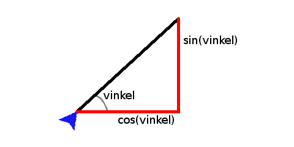
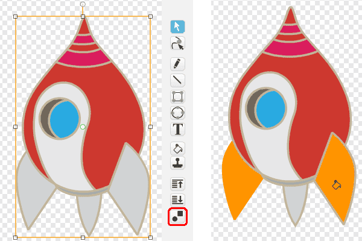

# Introduksjon {.intro}

Lunar Lander ble opprinnelig utviklet på slutten av 1970-tallet. Målet med
spillet er å lande et romskip på månen. Selve kontrollen av romskipet ble
videreført i spillet Asteroids som ble utgitt året etter.


# Oversikt over prosjektet {.activity}

_Mesteparten av kodingen av Lunar Lander skal du gjøre selv. I Lunar Lander vil
vi spesielt bruke litt tid på gjøre den fysiske modelleringen av romskipet
ganske realistisk._

## Plan {.check}

- Et flyvende romskip

- Vi ankommer månen

- Klar for landing

- Begrenset drivstoff, flere landingsplasser og andre utfordringer

# Steg 1: Et flyvende romskip {.activity}

Vi skal nå programmere et romskip som flyr rundt på skjermen. For å ha kontroll
på bevegelsen vil vi bruke to variable, `fartX`{.blockdata} og
`fartY`{.blockdata}, som beskriver hvor raskt romskipet beveger seg henholdsvis
sidelengs og opp-og-ned. Ved å bruke begge disse samtidig vil romskipet kunne
bevege seg i hvilken som helst retning.

Utfordringen i programmeringen av spillet er at romskipet kan rotere uavhengig
av hvilken retning det faktisk flyr. Når spilleren trykker pil-opp for å bruke
motoren vil vi gi romskipet ekstra fart i den retningen det peker. Det betyr at
vi må fordele farten i romskipets retning i hvor mye sidelengs fart det får, og
hvor mye av farten som går opp eller ned.

Dette virker umiddelbart kanskje litt vanskelig, men det er akkurat dette de
matematiske funksjonene `sinus` og `cosinus` gjør. I funksjonen nedenfor
forteller for eksempel `cosinus(vinkel)` oss hvor lang den vannrette streken er
i forhold til den skrå streken.



## Sjekkliste {.check}

- Start et nytt prosjekt. Slett kattefiguren.

- Legg til en romskip-figur. Du kan gjerne bruke `Romfart/Spaceship`.

- Lag romskipet ganske lite. Du kan for eksempel bruke

  ```blocks
  sett størrelse til (20) %
  ```

  rett etter at det grønne flagget er klikket.

- Lag to nye variable, `fartX`{.blockdata} og `fartY`{.blockdata} som
  gjelder kun for denne romskip-figuren.

- Vi lager først hovedløkken som lar romskipet falle, kun påvirket av
  tyngdekraften. Skriv denne koden:

  ```blocks
  når jeg mottar [Nytt spill v]
  gå til x: (0) y: (175)
  pek i retning (90 v)
  sett [fartX v] til [0]
  sett [fartY v] til [0]
  gjenta for alltid
      endre [fartY v] med (-0.01)
      endre x med (fartX)
      endre y med (fartY)
  slutt
  ```

  Om du prøver spillet ditt nå skal romskipet falle stadig raskere nedover
  skjermen. Prøv å endre litt i klossen

  ```blocks
  endre [fartY v] med (-0.01)
  ```

  Det er denne som modellerer tyngdekraften. Om du forandrer verdien her vil
  romskipet falle raskere eller tregere, eller det kan til og med falle oppover
  om du lar tyngdekraften være positiv.

- Vi vil nå programmere kontrollen av romskipet. Først og fremst vil vi at
  romskipet vender seg når vi trykker på piltastene mot høyre og venstre.

  Legg til to `hvis`{.blockcontrol}-blokker inne i `for alltid`{.blockcontrol}-løkken hvor du `vender`{.blockmotion} romskipet for
  eksempel `5` grader mot høyre eller venstre avhengig av hvilken piltast som
  trykkes.

- Når pil opp-tasten trykkes vil vi at romskipet skal få litt ekstra fart i
  den retningen romskipet peker. Som vi snakket om tidligere kan vi bruke de
  matematiske funksjonene sinus og cosinus for å få til dette. Legg også til
  denne blokken inne i `gjenta for alltid`{.blockcontrol}-løkken din.

  ```blocks
  hvis <tast [pil opp v] trykket?>
      endre [fartX v] med ((0) - ([cos v] av (retning)))
      endre [fartY v] med ([sin v] av (retning))
  slutt
  ```

  Du finner både sinus og cosinus-funksjonene som valg på klossen

  ```blocks
  ([kvadratrot v] av (9))
  ```

  Vi må bruke `((0) - ([cos v] av (retning)))`{.b} i stedet for `([cos v] av (retning))`{.b} fordi `retning`{.blockmotion} i Scratch måles motsatt vei av
  hvordan man måler vinkler i matematikk.

- Prøv spillet ditt. Kan du styre romskipet rundt på skjermen? Dersom du
  synes romskipet flyr for raskt eller sakte kan du justere `endre fart`{.blockdata}-klossene, for eksempel slik,

  ```blocks
  endre [fartX v] med ((0.3) * ((0) - ([cos v] av (retning))))
  endre [fartY v] med ((0.3) * ([sin v] av (retning)))
  ```

  Pass på at du justerer begge klossene med det samme tallet.

# Steg 2: Vi ankommer månen {.activity}

_Nå skal vi legge til et månelandskap hvor spilleren skal prøve å lande._

## Sjekkliste {.check}

- Lag en ny bakgrunn, hvor du tegner et passende månelandskap. Gjør det så
  lett eller vanskelig som du selv vil. Tegn også inn en eller flere
  landingsplasser hvor romskipet skal lande. Vi vil bruke `berører fargen`{.blocksensing}-klosser for å sjekke landingen senere, så det enkleste
  er å bruke en farge for landskapet og en annen for landingsplassen.

- For at romskipet skal slutte å fly når det treffer bakken kan du bytte ut
  `gjenta for alltid`{.blockcontrol}-løkken med en `gjenta til`{.blockcontrol}-løkke
  hvor du tester på om romskipet `berører fargen`{.blocksensing} du har brukt på
  landskapet eller på landingsplassen.

- Legg også til en `send melding [Sjekk landing v]`{.b} rett etter `gjenta til`{.blockcontrol}-løkken.

- Prøv spillet ditt igjen. Du skal nå kunne fly rundt helt til romskipet
  kommer nær bakken.

# Steg 3: Klar for landing {.activity}

_Vi vil til slutt sjekke hvor og hvordan romskipet landet._

## Sjekkliste {.check}

- Når vi sjekker landingen til romskipet vil vi skille mellom tre
  forskjellige tilfeller:

  **1**: Romskipet landet utenfor landingsplassen (kræsjet).

  **2**: Romskipet landet på landingsplassen, men landet enten på
  skrå (eller opp-ned) eller for raskt.

  **3**: Romskipet landet perfekt på landingsplassen.

  Lag et nytt skript på romskipet som starter når det mottar meldingen `Sjekk landing`. Under denne klossen må du bruke `hvis`{.blockcontrol}- og `hvis ellers`{.blockcontrol}-klosser som tester for de tre tilfellene. Du kan for
  eksempel si at landingen er perfekt dersom romskipet lander på
  landingsplassen, `fartY`{.blockdata} er større enn `-1.5` og
  `retning`{.blockmotion} er mellom `80` og `100`.

- Finn en måte å fortelle spilleren hvordan romskipet landet. Det enkleste
  er kanskje å bare bruke en `si`{.blocklooks}-kloss. Men du kan også bruke
  lydeffekter, forskjellige drakter eller kanskje en tekstplakat som dukker opp.

# Steg 4: Videreutvikling av spillet {.activity}

_Du har nå laget en enkel variant av Lunar Lander. Men prøv å gjøre spillet
morsommere ved å videreutvikle det. Du bestemmer selv hvordan du vil jobbe
videre, men nedenfor er noen ideer som kanskje kan være til inspirasjon?_

## Ideer til videreutvikling {.check}

- Lag flere landingsplasser. Kanskje noen kan være vanskeligere enn andre å
  lande på (enten på grunn av terrenget eller fordi selve landingsplassen er
  mindre).

- Lag flere bakgrunner eller brett. Du kan enten la spilleren velge seg en
  bakgrunn å spille på i begynnelsen av spillet, eller gå videre fra brett til
  brett etterhvert som spilleren klarer å lande.

- Du kan også bruke flere bakgrunner som et brett. Dersom romskipet flyr ut
  av skjermen på høyre side kan du la det dukke opp igjen på venstre side av en
  annen bakgrunn, og motsatt.

- Prøv å animere bruken av motoren. For eksempel, kan du lage en kopi av den
  flyvende romskip-drakten, og endre den som følger. Klikk først på romskipet,
  og deretter på den nye knappen som dukker opp nederst i knapperekka (markert
  med rødt i figuren til venstre). Denne vil dele opp romskip-figuren i mindre
  deler. Velg en passende flammefarge, og bruk malingsspannet til å fargelegge
  de tre finnene på romskipet slik at det ser ut som flammer som kommer fra
  motoren.

  

- En av utfordringene i det originale Lunar Lander-spillet var at spilleren
  bare hadde begrenset drivstoff tilgjengelig. Du kan legge til dette i ditt
  spill ved å lage en `Drivstoff`{.blockdata}-variabel som du lar bli stadig
  mindre etterhvert som spilleren trykker på piltastene. Dersom romskipet går
  tomt for drivstoff kan du ignorere tastetrykkene fra spilleren og bare la
  romskipet sveve til det til slutt kræsjer.

- Du kan lage forskjellige bonusting som spilleren kan plukke opp. For å
  gjøre det litt utfordrende kan du la disse ligge på måneoverflaten slik at
  spilleren må manøvrere forsiktig for å få tak i dem. Eksempler på slike
  bonusting kan være ekstra drivstoff, bonuspoeng, større landingsplass og så
  videre.

- En større endring i spillet kan være at landingsplassen er skjult under
  bakken når spillet begynner, og spilleren må grave denne frem ved å slippe
  bomber fra romskipet. Du kan implementere dette for eksempel ved bruk av noen
  av klossene under `Penn`{.blockpen}-kategorien.
